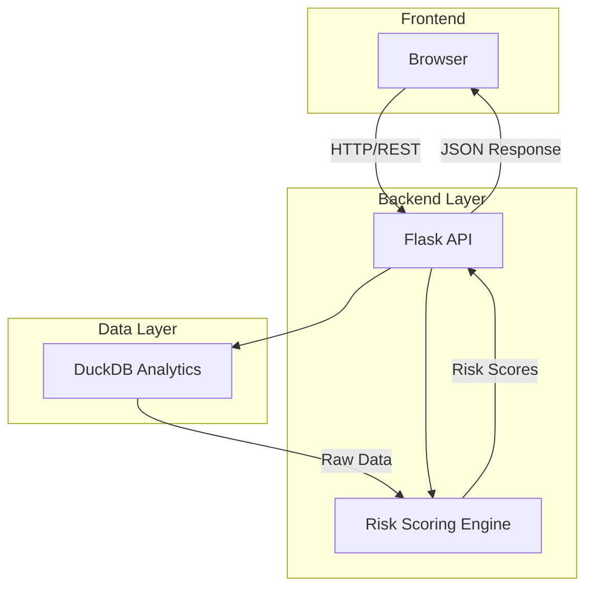

# 🏗️ System Architecture

## High-Level Overview

## Component Breakdown

| Layer        | Technology                  | Purpose                         |
| ------------ | --------------------------- | ------------------------------- |
| Presentation | HTML5 + Bootstrap 5 + D3.js | Interactive visualizations      |
| API          | Flask 3.0 + SQLAlchemy 2.0  | REST endpoints + Business Logic |
| Analytics    | DuckDB                      | High-performance OLAP queries   |
| Scoring      | Custom Python Algorithm     | Multi-factor risk calculation   |

## Data Flow

1. User Request → Flask API
2. Query DuckDB → Raw device/account data
3. Risk Engine → Calculate scores
4. D3.js → Render interactive graph
5. User Interaction → Real-time updates

